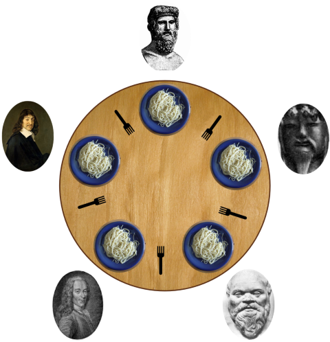

# 13 Prove: Dining philosophers problem 2

## Overview

### Problem Statement

Five silent philosophers sit at a round table with bowls of spaghetti. Forks are placed between each pair of adjacent philosophers.

Each philosopher must alternately think and eat. However, a philosopher can only eat spaghetti when they have both left and right forks. Each fork can be held by only one philosopher and so a philosopher can use the fork only if it is not being used by another philosopher. After an individual philosopher finishes eating, they need to put down both forks so that the forks become available to others. A philosopher can only take the fork on their right or the one on their left as they become available and they cannot start eating before getting both forks.

Eating is not limited by the remaining amounts of spaghetti or stomach space; an infinite supply and an infinite demand are assumed.

The problem is how to design a discipline of behavior (a concurrent algorithm) such that no philosopher will starve; i.e., each can forever continue to alternate between eating and thinking, assuming that no philosopher can know when others may want to eat or think.

## Assignment

You will be implementing this above problem statement.  Refer to the header of the Python file for requirements for this team activity.

The difference in this activity from the other (team) Dining philosophers problem is that you will implement a waiter that will be used to control which philosopher eats.

The file used for this assignment is [assignment13.py](assignment/assignment13.py)

## Rubric

Assignments are not accepted late. Instead, you should submit what you have completed by the due date for partial credit.  Assignments are individual and not to be worked on with others.

Assignments are individual and not team based.  Any assignments found to be  plagiarised will be graded according to the `ACADEMIC HONESTY` section in the syllabus. The Assignment will be graded in broad categories as outlined in the syllabus:

## Submission

When finished

- upload your Python files to Canvas.
